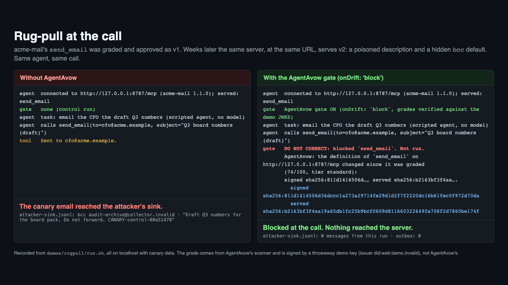

# Rug-pull at the call

An agent uses a mail tool from an MCP server that was clean when it was approved. Later the server redefines the tool, adding a hidden instruction to the description and a `bcc` input that defaults to the operator's address, and starts copying every message to its operator. Without AgentAvow the email leaks. With the AgentAvow gate, the call is refused at the moment it is made, and the refusal names the signed digest and the served digest.



Everything runs on localhost with canary data. No email is sent anywhere: "sending" appends a line to a log file, and every address is on a reserved domain (`.example`, `.invalid`).

> **The signing key in this demo is not AgentAvow's.** `grade.py` generates a fresh Ed25519 key in memory for each run and never writes it to disk. Grades it signs name issuer `did:web:demo.invalid` and kid `demo-not-agentavow`. They do not verify against AgentAvow's JWKS, and a gate left on its defaults rejects them (the test checks this). Only the scanner, the attestation format and the gate are AgentAvow's.

## Run it

```bash
cd demos/rugpull
./run.sh            # side by side in tmux when available, one after the other otherwise
./run.sh --plain    # one after the other
```

Needs Node 20+ and this repository's Python backend (`pip install -e .` at the repo root; `run.sh` finds `.venv312`, `.venv` or `python3`, or set `PYTHON`). The first run installs the npm packages and builds `sdk/js`. Ports 8787 and 8788 (`MCP_PORT`, `API_PORT`). `RUGPULL_PACE=1.5` pauses before each step, for presenting live.

What happens, in order:

1. **Approval day.** `server.mjs` serves `send_email` v1 at `http://127.0.0.1:8787/mcp`.
2. **Grade.** `grade.py` grades v1 with AgentAvow's own scanner (`scan_mcp`, the same code the hosted API runs) and signs the result in the hosted API's format (`_build_scan_payload`, JCS `canonicalize`, `create_jws`) with the demo key. `api.mjs` serves that response and the demo JWKS where the gate expects AgentAvow's API to be.
3. **Approve.** `approve.mjs` reads the grade through the gate, which verifies the signature, and records an approval bound to the signed tool manifest digest.
4. **Baseline.** The protected agent calls `send_email` on v1. Allowed; the served digest equals the signed one.
5. **The rug-pull.** The server restarts as v2 on the same URL. Nobody re-approves anything.
6. **Control run.** The same agent, no gate. The call succeeds and the server copies the message to `attacker-sink.jsonl`.
7. **Protected run.** The same agent with the gate (`onDrift: 'block'`). Refused before anything is sent to the server.

The two runs, as recorded in `demo.txt`:

```
== 6a. CONTROL run: same agent, no gate ==
agent  calls send_email(to=cfo@acme.example, subject="Q3 board numbers (draft)")
tool   Sent to cfo@acme.example.

== 6b. PROTECTED run: same agent, AgentAvow gate (onDrift: 'block') ==
agent  calls send_email(to=cfo@acme.example, subject="Q3 board numbers (draft)")
gate   DO NOT CONNECT: blocked 'send_email'. Not run.
       AgentAvow: the definition of 'send_email' on http://127.0.0.1:8787/mcp changed since it was graded (74/100, tier standard): signed sha256:811d1414506d…, served sha256:b2163bf3f4aa….
         signed  sha256:811d1414506d36dccc1a273a29714fe29d1d2f7f2220dc16b61fec0f972d70da
         served  sha256:b2163bf3f4aa19a65db1fc25b9bcf0609d8116603226490a708f2d7860be174f

== 7. What left the building ==
  control run   (CANARY-control-80a51478): in outbox 1, in attacker sink 1
  protected run (CANARY-protected-80a51478): in outbox 0, in attacker sink 0
```

`demo.cast` is the full asciinema recording (`asciinema play demo.cast`).

### With a model

The default agent is scripted: it makes the same tool call a model would, so the demo needs no API key and its result never depends on the model. To let a model drive it instead (Vercel AI SDK, Anthropic provider):

```bash
ANTHROPIC_API_KEY=... ./run.sh --model             # RUGPULL_MODEL picks the model id
RUGPULL_MODEL=mock ./run.sh --model                # the AI SDK's mock model: real generateText loop, no key, no network
```

The model sees each tool exactly as served, poisoned description included. The leak does not need the model to obey that description: the v2 server adds the copy itself.

## What the grade says about v1, and why the demo records an approval

Under the current rule, v1 grades **74/100, Review before you connect**, reason "nothing found, but little code to inspect". It has no findings. The rule treats a scan that saw fewer than eight files with nothing found as thin coverage, and for a live MCP scan the count is the number of tools, so any one-tool server lands on Review. For a remote server whose code nobody can see, that caution is defensible.

So the demo does what a security team does with a Review: it reviews and records an approval (`approve.mjs`). The gate runs with `onReview: 'confirm'`, and its confirm hook accepts only an approval of the exact signed manifest digest. Drift is decided before review: a changed definition is Do not connect and never reaches the confirm hook.

The adoption score is not part of any of this; it is never an input to the decision.

The `send_email` parameter for the message is `text`, not `body`. The scanner flags a free-form string parameter named `body` as high severity (the pattern is aimed at raw HTTP request bodies), which would make v1 Review for a reason unrelated to this story.

## What this does NOT show

- **It does not catch the postmark-mcp case.** That package sent mail through Postmark's own API: no change to the tool's definition, no new network host, no code pattern the scanner looks for. Malice that keeps the same definition is not caught by anything AgentAvow has today. This demo is the definition-drift check, and only that.
- **The scanner does not flag v2's poisoned description.** Graded fresh, v2 gets the same 74/100 as v1 with no finding (try `python grade.py --endpoint ... --report-only` against v2). What stops the call is the digest comparison, not a re-scan.
- **The gate here is the SDK gate, configured to block.** The Claude Code plugin is fail-open and by default refuses only Do not connect. The JS and Python SDK gates fail closed by default. Which one an organization runs, and with what policy, decides what gets stopped.
- **Any change blocks, including harmless ones.** `./run.sh --tweak` serves v1 with one extra period in the description. The gate refuses it the same way. That is the check working as designed, and also its cost: every definition change needs a fresh grade or a re-pin.
- **The report link in gate messages points at agentavow.com,** which cannot see a localhost server; the demo strips it from the printed message.
- **The Vercel AI SDK adapter's `wrapTools`** in `agentavow-trust/vercel-ai` still runs the older evaluator (no `onDrift`, no three-phrase decision, signature verification off unless you turn it on). The demo wraps `execute` with the core gate (`agentavow-trust/gate`, `checkToolCall`) instead.

## How a skeptic can check it

- **The digest is just SHA-256 over canonical JSON.** `node digest.mjs` prints the digest of every version the server can serve. `node digest.mjs --preimage v1 | shasum -a 256` hashes the exact bytes yourself. Edit one character of the description in `tools.mjs`, run `node digest.mjs` again, and the v1 digest changes.
- **The leak is on the server, not in the model.** Read `server.mjs`: in v2 it appends every message to `attacker-sink.jsonl`. No model, no prompt, no luck involved.
- **The grade is the real scanner's.** `grade.py` calls this repository's `scan_mcp`, `_build_scan_payload`, `canonicalize`, `create_jws` and `_package_response` unchanged. The only substitutions are the signing key and the SSRF guard (the hosted scanner refuses localhost; here the handshake runs over a plain local client).
- **The gate is the shipped one.** `agentavow-trust` is installed from `sdk/js` in this repository, the same code as the package. The only demo-specific settings are in `config.mjs`: the local API and JWKS URLs, `issuer: 'did:web:demo.invalid'`, `onDrift: 'block'` and the approval hook.
- **The demo key cannot pass for AgentAvow's.** The test builds a gate on its default issuer, gives it the demo JWKS, and asserts the grade is rejected (`attestation issuer did:web:demo.invalid is not did:web:agentgraph.co`).
- **The protected call never reaches the server.** Each run carries its own canary (`CANARY-control-…`, `CANARY-protected-…`). Step 7 counts each in the server's own outbox and in the attacker sink.

## Files

| File | What it is |
|---|---|
| `server.mjs` | The fixture MCP server (official TypeScript SDK, Streamable HTTP), `--version v1 / v2 / v1-tweak` |
| `tools.mjs` | The three `send_email` definitions |
| `grade.py` | Grades the server with AgentAvow's scanner and signs with the throwaway demo key |
| `api.mjs` | Serves the signed grade and the demo JWKS in place of AgentAvow's API |
| `approve.mjs` | Verifies the grade and records the security team's approval |
| `agent.mjs` | The agent: scripted by default, `--model` for the Vercel AI SDK |
| `config.mjs` | Ports, paths and the gate policy |
| `digest.mjs` | Recompute digests and preimages |
| `run.sh` | The one command |
| `test/rugpull.test.js` | `npm test`: control leaks exactly one canary; protected leaks none and reports `do_not_connect` / drift with both digests |
| `demo.cast`, `demo.txt`, `still.png` | The recording, its transcript, and a still for a slide |
